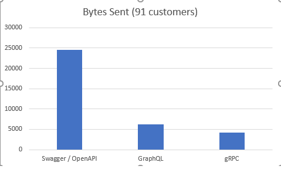

# Northwind API Sampler
This project is meant to enable exploration and comparison 
between different API technologies within ASP.NET Core:

* [OpenAPI / REST / Swagger / JSON](http://spec.openapis.org/oas/v3.0.3) 
* [GraphQL](https://graphql.org/)
* [gRPC](https://grpc.io/)

## Running the project 
### Setting up the Postgres database (easy!)
This project references a localhost instance of Postgres containing the Northwind database.

If you have Docker desktop installed, the repo below has some instructions on getting the database set up.
https://github.com/dahlsailrunner/northwind_psql

```
docker-compose -f .\docker-compose-windows.yml up
```

**N O T E :** You'll need to have a Docker compose file that exposes port 5432 like the one above does. Using that compose file should work fine. If you don't want to create the external volume, then modify the existing `docker-compose.yml` file and add the section for `ports` like the file above does.  

Then simply run:
```
docker-compose up
```
### Running the API
Clone the repo and build it, then run.

It should open a browser to the Home page, with links across the top for the Swagger interface, the GraphQL playground, and the proto file for a Customer service.

NOTE:  You need to run "NorthwindApiSampler" (not IISExpress) if you want the gRPC stuff to work.

Here's a screenshot of the home page you should see:


## Miscellaneous Notes
### Data access
Uses Dapper, plus some very helpful information posted by Andrew Lock:
https://andrewlock.net/using-snake-case-column-names-with-dapper-and-postgresql/

### DataModels folder
This folder contains simple POCOs that represent the objects that are in the Northwind database.
Note the C# style naming of these; the Postgres database has different names and the logic for 
making the translactions is all in the Repositories folder and the Dapper line in Startup.cs that adds 
the underscore-handling.

### Graph folder
This folder has the majority of the GraphQL-specific files / classes. 

### Protos and Services folders
The `Protos` folder has gRPC protobuf files that are also exposed as static files when 
the website is running to enable referencing them for new clients.
The `Services` folder has the implementation of the gRPC services.

### Clients 
There are two console apps in the solution that can be run as long as the Api is running.  They 
are GraphQL and gRPC clients that call the endpoints.

### Logging
[Serilog](https://serilog.net) is used for the logging, and when this project is 
run using Kestrel (and not IIS Express) it will show log entries in the console and a file
that include the size of the DATA being sent in a response.  This is useful 
to inspect the size of the payloads being put on the wire.

## Sample Payloads
The OpenAPI "Customers" endpoint includes all fields for the Customer object.
The OpenAPI datapoint shows the amount of data put on the wire for a "Get all" request.

The GraphQL endpoint exposes all fields as well, but only three are requested, and the datapoint 
shows the amount of data on the wire for that request.

The gRPC service has been defined to only include the three desired fields and the data is shown there also.

All three requests return data for 91 customers.

